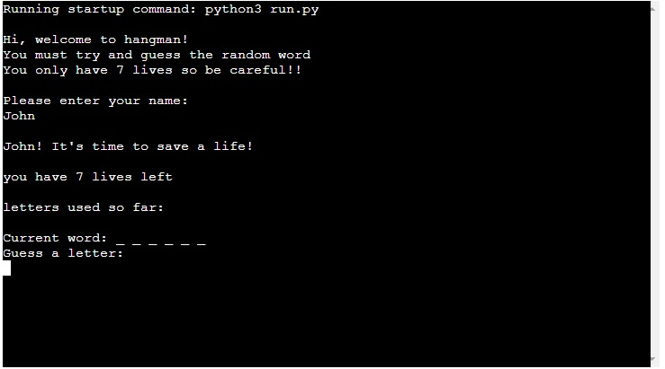

# Hangman!

Hangman is a re-imagined take on the classic guessing game where an individual attempts
to figure out a word using a limited number of guesses.

More information regarding the origin and convential method of playing can be found on wikipedia -

[Hangman](https://en.wikipedia.org/wiki/Hangman_(game))

The game has been designed as a deliverable for the third project in the Code Institutes Diploma
in Full Stack Software Development.

Technologies used - Python.

The live program can be reached [HERE](http://hangmanproject3.herokuapp.com/)

## How to Play

In this version of hangman, a random word is selected from a pre populated
list then the user is asked for their name.

The user is warned that they have 7 lives and must guess carefully.

The user can see how many letters are in the word that they must guess.

If the user makes a correct guess, the letter will fill into its slot and
the game will continue, if the user makes a wrong guess, a life will be subtracted
and the game will continue.

The game will continue until the user figures out the word or runs out of lives.

You win the game if you solve the word before running out of lives.

## Initial Planning

A wireframe was devised to provide a model to work towards as
this project was developed -

## Features

### Introduction screen

The initial page is a brief welcome and explanation as to what the user is expected to do,
followed by a request for the user's name.

### Initial Guess

Once the user inputs their name, the game will respond and tell them its time to start. The
user will be presented with a blank word with a certain number of characters and their first
guess is requested.

### Correct Choice

If the user makes a correct guess, the letter will populate in the relevant position and the
user is congratulated and prompted to make their next guess.

### Wrong Choice

If the user makes an incorrect guess, they will lose a life and be prompted to make their next guess.

### Duplicate Guess

If the user inputs a character they have already guessed they will be told that this has already been
guessed and to have another guess.

### Winner

If the user manages to successfully guess all the letters in the word, they will be congratulated, thanked for playing
and asked if they would like to exit or play again.

### Loser

If the user runs out of lives, the word they were trying to guess will be populated and they will be prompted with an
option to start again or quit the game. 

## Testing

- Passed the code through Python Lint (Syntax check) online -[infoheap](https://infoheap.com/python-lint-online/), this 
returned python is valid

- Tested the program on Heroku terminal

- implemented various tests, put in special characters and made
sure that these were not accepted, input more than one character at a time and input numbers to assure validation in place

- Ran code through Code Institute Python Linter and rectified
all errors, no outstanding issues - [CI Python Linter](https://pep8ci.herokuapp.com/)

## Future Expansion

- Import a larger array/set of words to shuffle through to present a less predictable challenge
- design command line art to show the various stages of the game as you progress
- difficulty levels that create variables such as less lives and larger words

## Bugs

- No bugs remain at this time

## Validator

- No errors identified from syntax check online [infoheap](https://infoheap.com/python-lint-online/)

- Ran code through Code Institute Python Linter and rectified
all errors, no outstanding issues - [CI Python Linter](https://pep8ci.herokuapp.com/)

## Deployment

This project was deployed using Code Institute's mock terminal
for Heroku

- Steps for Deployment:
    - forked sample Code Institute [repository](https://github.com/Code-Institute-Org/python-essentials-template)
    - Created the app on Heroku
    - Set the buildbacks to Python and NodeJS in that order
    - connected repository on Github to Heroku application
    - Deployed the application

## Credits and References

- Code Institute for the deployment fork/terminal
- Wikipedia for more info on hangman game origin
- Kylie Ying youtube tutorial, [How to Code a Game
of Hangman](https://www.youtube.com/watch?v=cJJTnI22IF8), utilised code blocks from this tutorial in my project
- Used code from [bobbyhadz.com](https://bobbyhadz.com/blog/python-input-only-letters-allowed) for validation of letter
only input
- Utilised [Freecodecamp](https://www.freecodecamp.org/news/python-string-format-python-s-print-format-example/)
 to implement f strings correctly
- referenced [W3Schools](https://www.w3schools.com/python/ref_random_shuffle.asp) to implement shuffle functionality
- Made wireframe using [canva](https://www.canva.com/)
- implemented code from [linuxhint](https://linuxhint.com/python-increment-by-1/#:~:text=Let's%20have%20a%20look%20at,value%20should%20be%201%20now.) in order to implement
lives functionality
- implemented delay and time functions learned from [pythonforbeginners.com](https://www.pythonforbeginners.com/code-snippets-source-code/game-hangman)
- implemented play again function learned from [python-forum.io](https://python-forum.io/thread-32088.html)