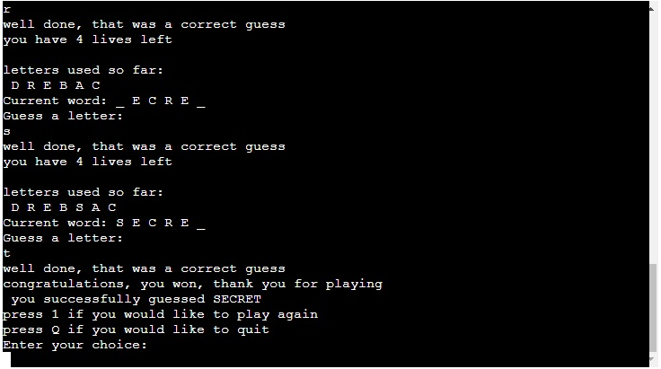

# Hangman!

Hangman is a re-imagined take on the classic guessing game where an individual attempts
to figure out a word using a limited number of guesses.

More information regarding the origin and convential method of playing can be found on wikipedia -

[Hangman](https://en.wikipedia.org/wiki/Hangman_(game))

The game has been designed as a deliverable for the third project in the Code Institutes Diploma
in Full Stack Software Development.

Technologies used - Python.

Link to live website as followed -

[Hangman game](http://hangmanproject3.herokuapp.com/)

place AMI RESPONSIVE HERE.

## How to Play

In this version of hangman, a random word is selected from a pre populated
list then the user is asked for their name.

The user is warned that they have 7 lives and must guess carefully.

The user can see how many letters are in the word that they must guess.

If the user makes a correct guess, the letter will fill into its slot and
the game will continue, if the user makes a wrong guess, a life will be subtracted
and the game will continue.

The game will continue until the user figures out the word or runs out of lives.

You win the game if you solve the word before running out of lives.

## Features

### Introduction screen

The initial page is a brief welcome and explanation as to what the user is expected to do,
followed by a request for the user's name.

### Initial Guess

Once the user inputs their name, the game will respond and tell them its time to start. The
user will be presented with a blank word with a certain number of characters and their first
guess is requested.

### Correct Choice

If the user makes a correct guess, the letter will populate in the relevant position and the
user is congratulated and prompted to make their next guess.

### Wrong Choice

If the user makes an incorrect guess, they will lose a life and be prompted to make their next guess.

### Duplicate Guess

If the user inputs a character they have already guessed they will be told that this has already been
guessed and to have another guess.

### Winner

If the user manages to successfully guess all the letters in the word, they will be congratulated, thanked for playing
and asked if they would like to exit or play again.

### Loser

If the user runs out of lives, the word they were trying to guess will be populated and they will be prompted with an
option to start again or quit the game. 

## Testing

- Passed the code through Python Lint (Syntax check) online -[infoheap](https://infoheap.com/python-lint-online/), this 
returned python is valid

- Tested the program on Heroku terminal

- implemented various tests, put in special characters and made
sure that these were not accepted, input more than one character at a time and input numbers to assure validation in place

## Bugs

- No bugs remain at this time

## Validator

- No errors identified from syntax check online [infoheap](https://infoheap.com/python-lint-online/) or on 
